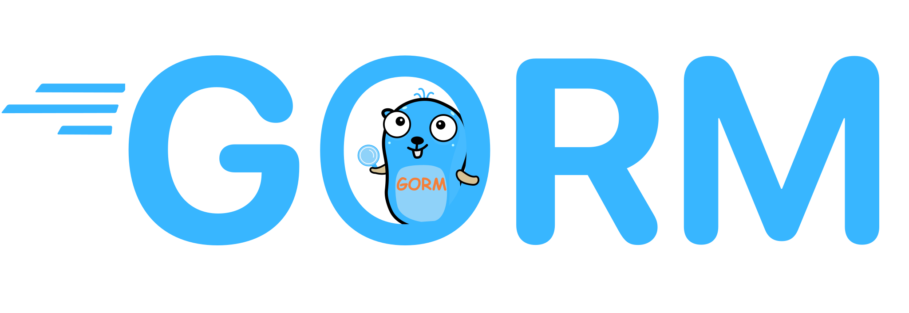

<h1 align="center"> GORM sample </h1>

<p align="center">
    
</p>

## Introduction

Golang doesn't have many ORMs and one the famous one is [GORM](https://gorm.io/).
Here we want to demonstrate some of its features using a very simple application.

## GORM

Here is the official GORM package:

- [gorm.io/gorm](https://pkg.go.dev/gorm.io/gorm)

The followings are GORM drivers for popular databases:

- [gorm.io/driver/postgres](https://pkg.go.dev/gorm.io/driver/postgres)
- [gorm.io/driver/mysql](https://pkg.go.dev/gorm.io/driver/mysql)
- [gorm.io/driver/sqlite](https://pkg.go.dev/gorm.io/driver/sqlite)

In the following code we create connection using GORM and have [zap](https://github.com/uber-go/zap) as our logger:

```go
import (
 "gorm.io/gorm"
 "gorm.io/driver/postgres"
 "moul.io/zapgorm2"
)

func main() {
 logger, err := zap.NewDevelopment()
 if err != nil {
  logger = zap.NewNop()
 }

 db, err := gorm.Open(postgres.Open(dsn), &gorm.Config{
  Logger: zapgorm2.New(logger),
 })
}
```

```go
type User struct {
 ID uint
 FirstName string

 CreatedAt time.Time
 DeletedAt time.Time
}


db.Where("name = ?", "parham").Last()
db.Where("name = ?", "parham").First()
db.Where("name = ?", "parham").Find()
```

- _User_ (structure): plural snake-case as table name
- _ID_ (field): primary-key by default, _please pay attention_
- _FirstName_ (field): snake-case as column name

Hooks as methods on model.

### JSON with SQL

You can also create custom JSON based data-types with the following example:

```go
// JSONMap defiend JSON data type, need to implements driver.Valuer, sql.Scanner interface
type JSONMap map[string]interface{}

// Value return json value, implement driver.Valuer interface
func (m JSONMap) Value() (driver.Value, error) {
  if m == nil {
    return nil, nil
  }
  ba, err := m.MarshalJSON()
  return string(ba), err
}

// Scan scan value into Jsonb, implements sql.Scanner interface
func (m *JSONMap) Scan(val interface{}) error {
  var ba []byte
  switch v := val.(type) {
  case []byte:
    ba = v
  case string:
    ba = []byte(v)
  default:
    return errors.New(fmt.Sprint("Failed to unmarshal JSONB value:", val))
  }
  t := map[string]interface{}{}
  err := json.Unmarshal(ba, &t)
  *m = JSONMap(t)
  return err
}

// MarshalJSON to output non base64 encoded []byte
func (m JSONMap) MarshalJSON() ([]byte, error) {
  if m == nil {
    return []byte("null"), nil
  }
  t := (map[string]interface{})(m)
  return json.Marshal(t)
}

// UnmarshalJSON to deserialize []byte
func (m *JSONMap) UnmarshalJSON(b []byte) error {
  t := map[string]interface{}{}
  err := json.Unmarshal(b, &t)
  *m = JSONMap(t)
  return err
}

// GormDataType gorm common data type
func (m JSONMap) GormDataType() string {
  return "jsonmap"
}

// GormDBDataType gorm db data type
func (JSONMap) GormDBDataType(db *gorm.DB, field *schema.Field) string {
  switch db.Dialector.Name() {
  case "sqlite":
    return "JSON"
  case "mysql":
    return "JSON"
  case "postgres":
    return "JSONB"
  }
  return ""
}
```
